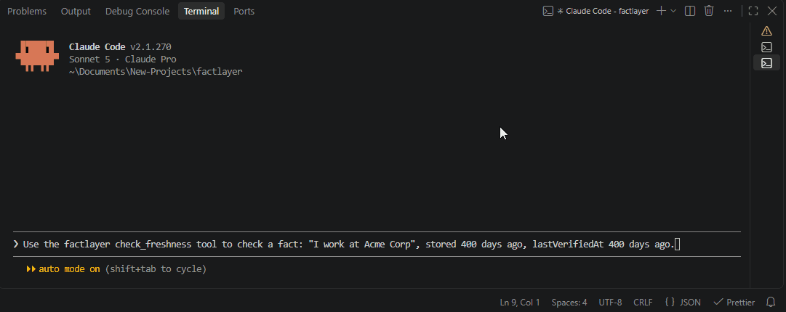
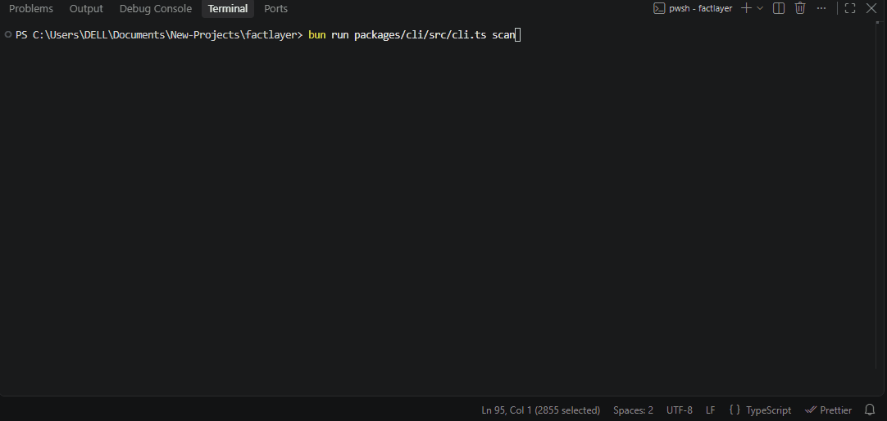
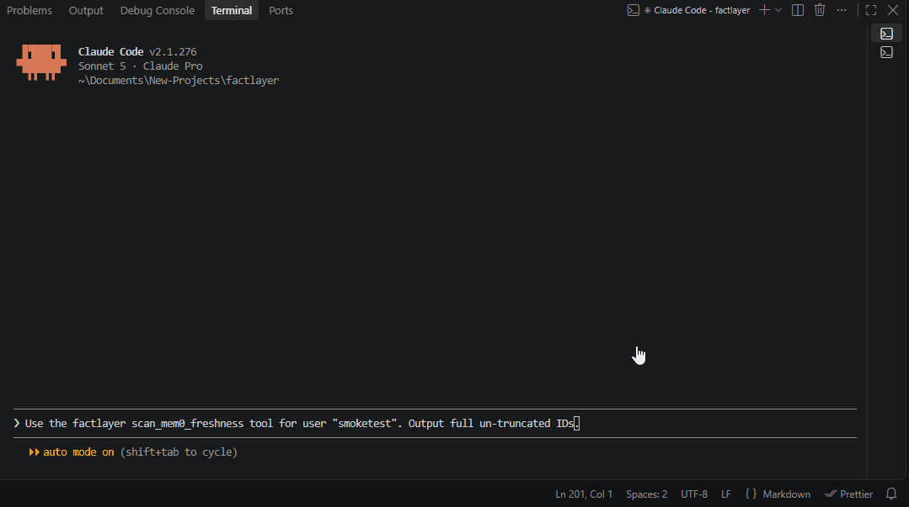
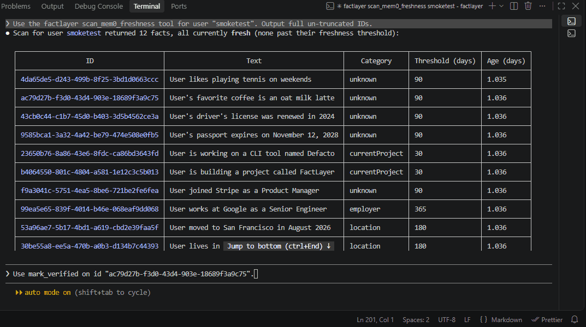

# FactLayer

[](https://www.npmjs.com/package/@factlayer/core)
[](https://www.npmjs.com/package/@factlayer/cli)
[](https://www.npmjs.com/package/@factlayer/adapter-mem0)
[](https://www.npmjs.com/package/@factlayer/mcp-server)
[](https://www.npmjs.com/package/@factlayer/adapter-zep)
[](https://www.npmjs.com/package/@factlayer/adapter-cognee)

**A freshness-check layer for AI agent memory plugs into Mem0, Zep, Cognee, or your own database, and catches facts before they go stale.**

A local-first fact freshness tracking system built to prevent LLM context drift and hallucinations.Your AI agent doesn't forget things. That's the problem. It remembers a customer's city, a user's job, a teammate's role and keeps repeating it with total confidence long after it's stopped being true. Nothing tells it to double-check. Nothing ever will, unless something is built to.

FactLayer is that something.

---

## The problem, in one story

Someone tells a support agent "I live in Seattle." Six months later they ask about shipping options. The agent still thinks they're in Seattle nobody ever told it otherwise, so as far as it's concerned, nothing changed. It answers confidently. It's wrong.

This isn't rare. It's the default behavior of every memory system in production today, and it has a name in the field: high-relevance facts the ones an agent uses constantly are exactly the ones that go stale silently, because "frequently used" and "still true" are treated as the same thing when they aren't.

Existing memory tools solve _adjacent_ problems well:

- **Zep / Graphiti** invalidates a fact when a _new, contradicting_ fact arrives. Excellent but only fires if something new ever comes in.

- **Cognee** decays facts based on _how often they're accessed_. Excellent but a wrong fact that's still asked about often looks perfectly healthy by that measure.

- **Mem0** now synthesizes and supersedes facts in the background — a real step forward, but still reactive to new information, not proactive about facts that were simply never revisited. Mem0's own 2026 state-of-the-field report names this gap directly. memory decay works for facts nobody cares about anymore, but a fact that's still retrieved constantly can go quietly wrong with nothing to catch it even the team closest to the problem calls it unsolved.

None of them ask the question FactLayer exists to ask: **"nothing has contradicted this fact but it's the kind of fact that tends to change, and it's been a while. Should we trust it blindly?"**

---

## What FactLayer actually does

FactLayer is not a memory store. It doesn't compete with Mem0, Zep, or Cognee, and it doesn't ask you to replace whatever you're already using. It's a thin layer that sits on top of any of them or a plain database and does one job:

1. **Classifies facts by volatility.** A phone number and a current job title don't age the same way. FactLayer tags facts into categories, each with an expected "shelf life" job/employer (~1 year), location (~6 months), current project (~1 month), static facts (never expire), and anything custom you define.
2. **Tracks when a fact was last _verified_, not just last _accessed_.** These are different numbers, and conflating them is exactly how stale facts hide in plain sight.
3. **Flags aging, high-relevance facts before they get used.** When a fact crosses its category's threshold, FactLayer marks it `needs-verification` instead of letting it be stated as current fact without question.

Auto-classification runs in two cheap tiers before ever reaching for anything expensive: fast keyword matching first, then a local embedding model (no API key, no GPU, runs fine on modest hardware) for phrasing keywords miss. Nothing gets forced into a guess genuinely ambiguous facts stay `unknown` and default to a conservative, shorter re-check window.

---

## See it catch a stale fact



`https://github.com/Rubber-Duck-Screaming/factlayer/releases/tag/v0.4`

---

## How it compares

|                                | Zep / Graphiti             | Cognee            | Mem0                            | **FactLayer**                                 |
| ------------------------------ | -------------------------- | ----------------- | ------------------------------- | --------------------------------------------- |
| Approach to staleness          | Contradiction invalidation | Usage-based decay | Background supersede/synthesize | Volatility-aware, time-based flagging         |
| Needs new info to act?         | Yes                        | No (needs disuse) | Mostly yes                      | **No acts on elapsed time + fact type alone** |
| Is it a memory store?          | Yes                        | Yes               | Yes                             | **No a layer on top of one**                  |
| Works with other memory tools? | No                         | No                | No                              | **Yes Mem0 today, more adapters planned**     |

FactLayer isn't trying to replace any of these. It's the check none of them run.

---

## Quickstart

```bash
bun install @factlayer/core @factlayer/cli
```

Add a fact and let it auto-classify:

```bash
factcheck add "I started working at Acme Corp"
```

Scan everything for facts that need a second look:

```bash
factcheck scan
```

```
[needs-verification] employer | 412 days old | I started working at Acme Corp
[fresh]               location | 12 days old  | I moved to Denver
```



Confirm a fact is still accurate:

```bash
factcheck verify <id>
```

### Using it with an existing memory system

```bash
bun add @factlayer/adapter-mem0
```

```ts
import { createMem0Client, scanMem0 } from "@factlayer/adapter-mem0";

const client = createMem0Client(process.env.MEM0_API_KEY);
const results = await scanMem0(client, { filters: { user_id: userId } });
// each result: { fact, result }  result.status is "fresh" | "needs-verification"
```

### Using it with Zep

```bash
bun add @factlayer/adapter-zep
```

```ts
import { createZepClient, scanZep } from "@factlayer/adapter-zep";

const client = createZepClient(process.env.ZEP_API_KEY);
const results = await scanZep(client, userId);
// each result: { fact, result }  result.status is "fresh" | "needs-verification"
```

### Using it with Cognee

Mem0 and Zep are hosted services you just read from point FactLayer at your existing account and it starts checking freshness. Cognee is different: in self-hosted mode, _you_ run the Cognee instance and configure your own LLM provider (any OpenAI-compatible endpoint) to do the ingestion and knowledge-graph extraction. FactLayer's Cognee adapter doesn't provide an LLM and doesn't run extraction itself it only reads records you've already fed into your own Cognee instance, tracking the freshness of that ingested source material.

```bash
bun add @factlayer/adapter-cognee
```

```ts
import { createCogneeClient, scanCognee } from "@factlayer/adapter-cognee";

const client = await createCogneeClient({
  llmModel: "your-model-id",
  llmApiKey: process.env.YOUR_LLM_KEY,
  // llmEndpoint: process.env.YOUR_LLM_ENDPOINT, // only needed for a non-OpenAI, OpenAI-compatible provider
});

// datasetId is Cognee's own dataset UUID, not the dataset name you passed
// to Cognee's add()/remember() calls  look it up via the underlying
// @cognee/cognee-ts SDK's datasets.list() if you only have the name.
const results = await scanCognee(client, datasetId);
// each result: { fact, result }  result.status is "fresh" | "needs-verification"
```

### Using it as an MCP server

Point any MCP-compatible agent (Claude Code, Claude Desktop, or your own) at FactLayer, and it gains freshness-checking as a tool call no code changes to your agent required.

```json
{
  "mcpServers": {
    "factlayer": {
      "command": "bun",
      "args": ["run", "packages/mcp-server/src/index.ts"]
    }
  }
}
```





`check_freshness`, `add_fact`, and `scan_facts` work with zero setup they're fully local, backed by FactLayer's own SQLite store, and need no external account. `scan_mem0_freshness`, `scan_zep_freshness`, and `scan_cognee_freshness` bridge to an existing memory system, so each needs its provider's API key set as an environment variable before starting the server (`MEM0_API_KEY`, `ZEP_API_KEY`, `OPENAI_TOKEN`).

Available tools:

- `check_freshness` checks whether a fact is fresh or needs re-verification (no setup required)
- `add_fact` adds a new fact to FactLayer's local store (no setup required)
- `scan_facts` lists every locally stored fact and checks each for freshness (no setup required)
- `mark_verified` marks a stored fact as verified as of now (no setup required)
- `scan_mem0_freshness` scans a Mem0 user's memories end to end and persists them locally (requires `MEM0_API_KEY`)
- `scan_zep_freshness` scans a Zep user's graph facts end to end and persists them locally (requires `ZEP_API_KEY`)
- `scan_cognee_freshness` scans a Cognee dataset's ingested records end to end and persists them locally (requires `OPENAI_TOKEN`, the env var Cognee's own SDK documents; `OPENAI_API_KEY` works as a fallback)

### Environment variables

Only needed for the tools that bridge to an existing memory system leave any out if you're not using that provider.

```json
{
  "mcpServers": {
    "factlayer": {
      "command": "bun",
      "args": ["run", "packages/mcp-server/src/index.ts"],
      "env": {
        "MEM0_API_KEY": "your-mem0-api-key",
        "ZEP_API_KEY": "your-zep-api-key",
        "OPENAI_TOKEN": "your-openai-compatible-api-key"
      }
    }
  }
}
```

---

## How the freshness model works

- **Category half-lives** each volatility tier has an expected duration a fact of that type tends to stay true. Configurable per project.
- **`expiresAt` for exact dates** some facts don't need a guess (a passport expiry, a contract end date). Set `expiresAt` directly and FactLayer skips the heuristic entirely, checking the real date instead.
- **Unknown defaults conservative, not permissive** a fact that can't be classified gets a _shorter_ re-check window than most named categories, not a longer one. Misclassification fails safe.

What FactLayer deliberately does **not** do: resolve contradictions between facts (that's Zep/Graphiti's job a good one, don't rebuild it), or know that a real-world fact changed without being told. It manages _risk based on elapsed time and fact type_ a smoke detector, not a camera.

---

## Architecture

```
factlayer/
├── packages/
│   ├── core/              check() engine, classify(), SQLite store
│   ├── cli/                factcheck command-line tool
│   ├── adapter-mem0/       read + persist bridge to Mem0
│   ├── adapter-zep/        read + persist bridge to Zep
│   ├── adapter-cognee/     read + persist bridge to Cognee
│   └── mcp-server/         exposes core over MCP (check_freshness, mark_verified, scan_mem0_freshness, scan_zep_freshness, scan_cognee_freshness)
```

Bun + TypeScript throughout. Local embedding classification via `@xenova/transformers` (`all-MiniLM-L6-v2`) no external API calls, no GPU required.

---

## Roadmap

- [x] Core freshness engine + category half-lives
- [x] Exact-date (`expiresAt`) support
- [x] Two-tier auto-classification (keyword → local embedding)
- [x] Mem0 adapter read, classify, persist, and act on real Mem0 data
- [x] MCP server `check_freshness`, `mark_verified`, `scan_mem0_freshness`
- [x] Zep adapter
- [x] Cognee adapter
- [ ] Contradiction-aware handoff (defer to Graphiti-style detection where available, rather than reimplementing it)

---

## Contributing

Issues and PRs welcome. This is an early, actively-developed project if you're building on Mem0, Zep, Cognee, or your own memory layer and hitting the staleness problem described above, I'd genuinely like to hear about your use case.

## License

This project is licensed under the [MIT License](./LICENSE).
